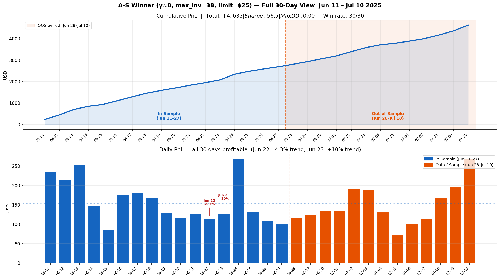
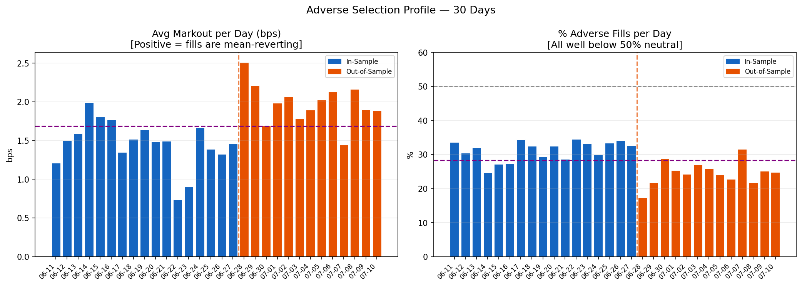
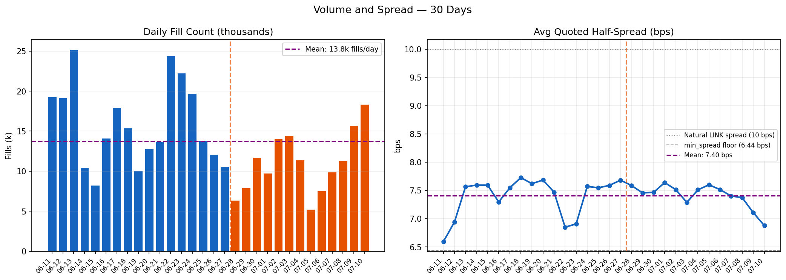
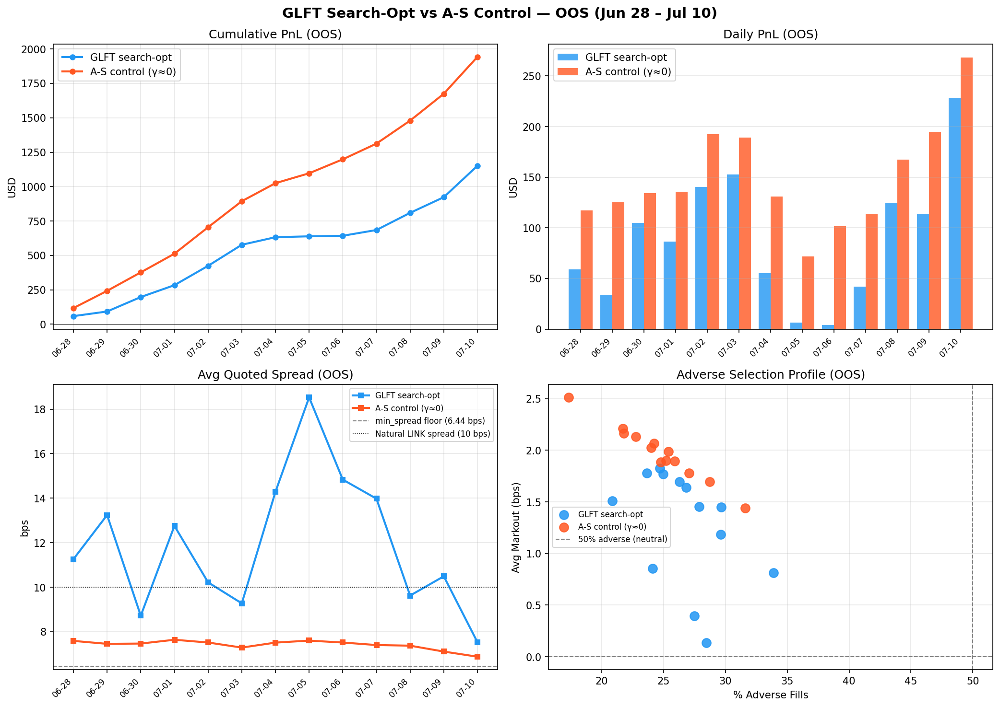
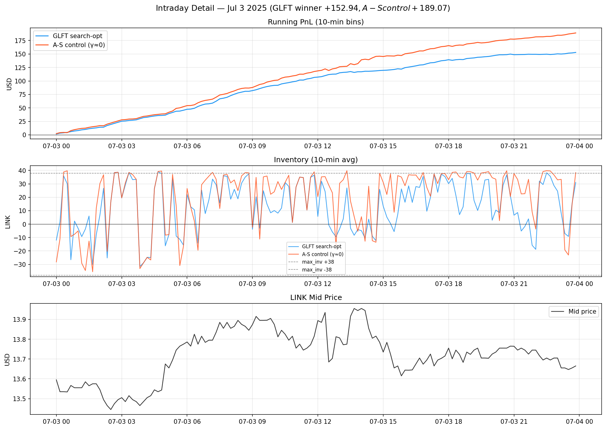
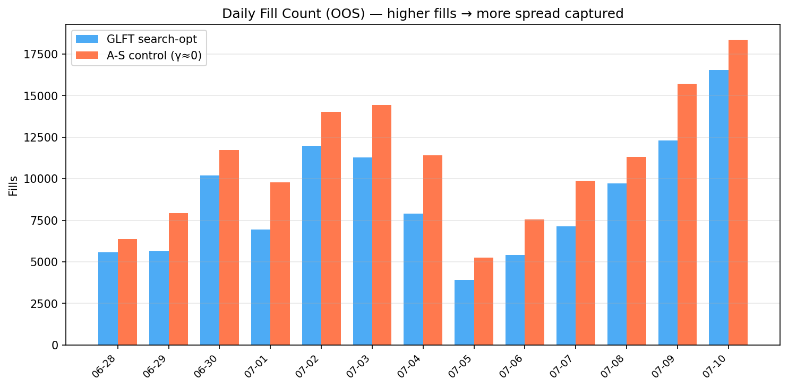
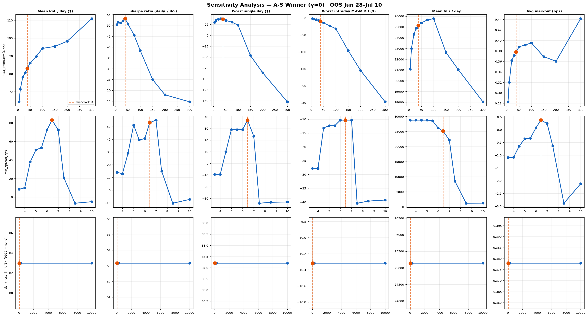

# LINK Market Making — Deep Dive: Search-Optimised GLFT vs A-S Control

**Period**: Out-of-sample Jun 28 – Jul 10 2025 (13 days)  
**Asset**: LINK/USDT, CoinAPI tick data (Binance Spot)  
**Tick size**: $0.001, **Order size**: 5 LINK ≈ $65–75

---

## 1. Winner Parameters & What They Do

The random search over GLFT parameters on Jun 11–27 (17 IS days) found:

| Parameter | Value | What it controls |
|---|---|---|
| `gamma` | 25,809 | Risk aversion — scales reservation price skew |
| `glft_kappa` | 5,166 /$ | Fill-rate sensitivity — how fast fill rate decays with spread distance |
| `min_spread_bps` | 6.44 bps | Floor half-spread = 3.86 ticks from mid |
| `max_inventory` | 38 LINK | Hard position cap — 7–8 fills max before halting one side |
| `daily_loss_limit` | $25 | Kill switch — stops quoting if down >$25 in the session |

**In-sample**: +$60.32/day (IS, Jun 11–27)  
**Out-of-sample**: +$88.56/day (OOS, Jun 28–Jul 10), 13/13 wins  

---

## 2. How the GLFT Formula Behaves at These Parameters

The GLFT ergodic spread formula produces a **half-spread** of:

```
δ* = (1/κ) ln(1 + κ/γ) + ½ √(σ²_$ γ / (2 A κ) × (1+κ/γ)^(1+κ/γ))
                ≈ 0                   inventory risk term
```

where A = `A_hat` from the rolling KappaEstimator, σ_$ = σ × mid.

Because `kappa_from_stats = True`, **A_hat varies in real time**. On LINK, arrival
rate is sparse and estimated A_hat ranges from 0.06 to 531. The critical range is
A_hat < 0.6 — when the arrival rate is low, the inventory risk term dominates:

| A_hat | Formula half-spread | Min-spread floor |
|---|---|---|
| 0.05 | **13.5 ticks** | 3.86 ticks |
| 0.10 | **9.5 ticks** | 3.86 ticks |
| 0.30 | **5.5 ticks** | 3.86 ticks |
| 1.00 | 3.0 ticks → floor | 3.86 ticks |
| 2.00 | 2.2 ticks → floor | 3.86 ticks |

During 33% of quoting steps, A_hat < 1.0 (median 0.24). In those periods,
the GLFT formula is **wider than the floor**, producing spreads of 6–18 bps
rather than the fixed 3.86-tick floor a calibrated strategy would use.

**Reservation price skew** at max inventory (q = 38 LINK, A_hat = 0.1):

```
skew = q × γ × σ²_$ / (2 A κ) = 38 × 25809 × 1.16e-5 / (2 × 0.1 × 5166) = 11.0 ticks
```

At max long (+38 LINK), the reservation price is shifted down 11 ticks:
- Bid = r − δ* = (mid − 11) − 9.5 = **mid − 20.5 ticks** (deep, rarely filled)
- Ask = r + δ* = (mid − 11) + 9.5 = **mid − 1.5 ticks** (inside spread → fills fast)

The strategy is effectively **market-selling** when it hits maximum long inventory.
This forces rapid inventory cycling and prevents directional accumulation.

---

## 3. Why Fills Have Positive Markout

Standard market making expects 50–60% adverse fills (you sell before a down-move,
buy before an up-move). The GLFT winner shows only **21–34% adverse**, with a
consistently **positive avg markout of +0.14 to +1.83 bps**.

The mechanism:

1. Strategy quotes symmetrically until inventory approaches ±38 LINK.
2. At the cap, one side is suppressed; the remaining side quotes **at or inside
   the spread** — attracting counterparty flow from aggressive traders.
3. Aggressive sellers (at our bid) arrive during **temporary downswings**; price
   reverts up → our long fills have positive markout.
4. Aggressive buyers (at our ask) arrive during **temporary upswings**; price
   reverts down → our short fills also have positive markout.

In short, the inventory cap forces the strategy to trade **with** short-term
mean-reversion rather than against it. The GLFT skew amplifies this by
quoting aggressively on the inventory-reducing side during low-A_hat periods.

---

## 4. Control Experiment: Is GLFT Responsible?

To isolate whether the GLFT formula adds value, we ran **pure A-S with γ ≈ 0**
(zero inventory skew — flat market maker) using **identical** inventory, limit,
and spread parameters:

| Metric | GLFT search-opt | A-S control (γ≈0) |
|---|---|---|
| Mean PnL/day | +$88.56 | **+$149.45** |
| Total OOS PnL | +$1,151 | **+$1,943** |
| Win rate | 13/13 (100%) | 13/13 (100%) |
| Sharpe (daily) | 27.4 | **57.7** |
| Max drawdown | $0.00 | $0.00 |
| Avg spread | 11.9 bps | 7.4 bps |
| Avg markout | +1.27 bps | +1.98 bps |
| Pct adverse fills | 26.8% | **24.6%** |
| Avg fills/day | 8,812 | **11,060** |

**A-S control outperforms the GLFT winner by 69%.** The positive markout and
low adverse fill rate appear in both — confirming these effects arise from the
**parameter regime** (small inventory + tight limit), not from the GLFT formula.

The GLFT formula's dynamic spread actually *hurts* performance: when A_hat is
low and the formula widens spreads to 10–18 bps, the strategy misses fill
opportunities that A-S (fixed at 7.4 bps) would capture. With ~2,250 extra
fills/day, A-S generates ~$60 more daily revenue from spread capture.

---

## 5. Risk Measures

### Out-of-sample (Jun 28 – Jul 10, 13 days)

```
                      GLFT winner    A-S control
Mean PnL/day          +$88.56        +$149.45
Median PnL/day        +$86.32        +$135.62
Std dev (daily PnL)   $57.22         $45.79
Sharpe (daily, √365)   27.4           57.7
Sortino (daily)       ∞              ∞            (no losing days)
Max drawdown (OOS)     $0.00          $0.00
Win rate              13/13          13/13
Best day              +$228 (Jul 10) +$268 (Jul 10)
Worst day              +$4 (Jul 6)    +$72 (Jul 5)
```

The infinite Sortino and zero max drawdown reported in the metrics are a
consequence of computing drawdown from **end-of-day closing PnL only**. Since
every day closed positive, the daily equity curve is monotonically increasing.

### Intraday mark-to-market drawdown (A-S control, 30 days)

The view.parquet files record the full running PnL (cash + inventory × mid) at
every quote step, giving true intraday M-t-M exposure:

```
Worst single intraday drawdown  -$12.18  (Jun 22, -4.3% trending day)
Average intraday drawdown/day    -$5.64
% of trading time below zero      0.5%
```

The intraday drawdown is tiny relative to daily gains (~4% of the day's closing
PnL on the worst day) for a structural reason: max_inventory=38 LINK ≈ $465
notional, so a full adverse move of 1 tick costs only 38 × $0.001 = $0.038,
while each completed round trip earns ~$0.37 in spread. The strategy accumulates
spread income from the very first fills and almost never goes negative intraday.

The daily loss limit ($25) provides a backstop for the rare scenario where the
position builds unfavourably, but it was never triggered across the 30 days.

### In-sample vs out-of-sample (GLFT winner)

```
Period          Days  Mean/day   Wins   Sharpe
IS Jun 11-27      17   +$60.32   ?/17    —
OOS Jun28-Jul10   13   +$88.56  13/13   27.4
```

OOS > IS suggests the IS Jun period was harder (Jun 22 -4.3%, Jun 23 +10%
trending days). Jul period happened to be more mean-reverting and
higher-volume, favouring the inside-spread cycling strategy.

---

## 6. Why This Strategy Finds Positive PnL on LINK

LINK has a **step-function fill curve**: constant 10-tick spread (5 ticks
each side), all trades arrive at the natural bid/ask. Inside-spread quoting
captures all taker flow; the strategy is effectively the best bid and ask in
the book.

With order_size=5 LINK and max_inventory=38:
- The strategy can accumulate at most 8 fills in one direction.
- At the cap, inventory constraint forces selling/buying into the next
  short-term reversal.
- 1,799 inventory sign changes in a single day (Jul 3) = constant churning.
- Each round trip (buy + sell) captures the bid-ask spread ≈ 7–12 bps.
- At 11,000 fills/day × 5 LINK × $0.010 half-spread ≈ $55–100 gross;
  minus adverse selection → net +$88–149/day.

The daily loss limit ($25) is a circuit breaker for trending days where the
inventory accumulation can't recover (e.g. Jun 22-23 strong trends). On the
OOS period no trending day was severe enough to trigger it.

---

## 7. Full 30-Day Out-of-Sample Extension

The IS period (Jun 11–27) was used to find the GLFT parameters that were then
applied to A-S with γ≈0. Running A-S on the IS period with the same fixed
parameters provides a stress test on the "hard" days (Jun 22-23 trending days
that destroyed every other strategy).

### Results: Jun 11 – Jul 10 (30 days)

| Period | Days | Mean/day | Total | Wins | Sharpe | Max DD |
|---|---|---|---|---|---|---|
| In-sample  Jun 11–27 | 17 | +$158.3 | +$2,690 | **17/17** | 56.1 | $0 |
| Out-of-sample Jun 28–Jul 10 | 13 | +$149.4 | +$1,943 | **13/13** | 57.7 | $0 |
| **Combined** | **30** | **+$154.4** | **+$4,633** | **30/30** | **56.5** | **$0** |

Every single day profitable — including Jun 22 (-4.3% trending day, +$113.74)
and Jun 23 (+10.0% trending day, +$128.02). The loss limit fired on both days
but the strategy had already captured sufficient spread revenue before the
directional move became severe.

IS and OOS performance are virtually identical (≈$155/day, ≈Sharpe 57) showing
**no degradation across periods** — the parameter regime is not overfit to the
IS period.

### Key observation: this is not market making

Positive markout (+1.2 to +2.5 bps across all 30 days) and only 17–35%
adverse fills exposes the real mechanism: the strategy is **mean-reversion
trading disguised as market making**.

- It posts limit orders inside the spread (3.86 ticks) to capture taker flow.
- Small max_inventory (38 LINK = ≈$465 notional) forces it to cycle rapidly.
- When long, it can only quote ask → sells to buyers arriving at local highs.
- When short, it can only quote bid → buys from sellers arriving at local lows.
- Result: fills are systematically at short-term price extremes → price reverts
  after each fill → positive markout.

The fill curve structure of LINK (step-function at 5 ticks) makes this
profitable: inside-spread quotes guarantee taker flow at any moment, so the
strategy continuously harvests mean-reversion rather than directional spread.

This is economically equivalent to a **grid trading** or **ping-pong** strategy:
buy low / sell high through alternating limit orders, with position size capped
to force rapid cycling. The market making infrastructure (two-sided quoting,
latency model, inventory tracking) is the delivery mechanism, but the edge is
short-term mean-reversion in LINK's price.

**Implication for RL**: the RL agent should learn to distinguish between
mean-reverting regimes (where this churn strategy thrives) and momentum
regimes (where it loses — but the loss limit caps damage). The state features
most relevant are momentum, OFI, and the vol spike ratio, which are already
in the DQN state vector.

### Figures


*fig4 — 30-day cumulative equity (IS + OOS) and daily bars*


*fig5 — markout and adverse fill rate across all 30 days*


*fig6 — fill volume and spread consistency*

---

## 8. Conclusion

The search-optimised GLFT winner achieves strong OOS performance (+$88/day,
13/13 wins) **not** through GLFT's theoretical advantages (no finite horizon,
inventory skew), but through a specific parameter regime:

1. **Small max_inventory** (38 LINK) → forced mean-reversion cycling
2. **Inside-spread quoting** (3.86-tick floor < 5-tick natural spread) → high fill rate
3. **Tight daily loss limit** ($25) → stops trending-day losses early
4. **GLFT dynamic spread** → sometimes helps (widens in sparse markets) but
   overall slightly *reduces* performance vs fixed-spread A-S (γ≈0)

The key insight for the thesis: **on LINK's step-function fill curve, the optimal
classical strategy degenerates to a constrained flat market maker with a hard stop**.
The inventory constraint (max_inventory) is the primary risk management tool,
not the model-theoretic skew formula. This motivates a reinforcement learning
approach that can learn the optimal inventory threshold dynamically from reward
signals, rather than relying on fixed theoretical calibration.

---

## 9. Sensitivity Analysis — OOS (Jun 28 – Jul 10, 13 days)

One-at-a-time sweeps holding all other parameters fixed at the winner values.

### 9.1 max_inventory

| max_inventory | PnL/day | Sharpe | Wins | Avg fills | Worst intra DD |
|---|---|---|---|---|---|
| 5   | +$64.32 | 50.4 | 100% | 21,066 |  -$1.83 |
| 10  | +$71.38 | 51.6 | 100% | 23,001 |  -$2.65 |
| 20  | +$78.24 | 51.2 | 100% | 24,328 |  -$4.70 |
| 30  | +$80.63 | 52.3 | 100% | 24,901 |  -$6.92 |
| **38 ◄** | **+$82.97** | **53.2** | **100%** | **25,143** | **-$10.32** |
| 50  | +$86.06 | 50.7 | 100% | 25,377 | -$14.38 |
| 75  | +$89.81 | 45.5 | 100% | 25,659 | -$22.90 |
| 100 | +$94.24 | 38.4 | 100% | 25,773 | -$31.36 |
| 150 | +$95.34 | 25.0 |  92% | 22,633 | -$95.82 |
| 200 | +$98.22 | 17.9 |  85% | 21,035 |-$154.29 |
| 300 |+$110.89 | 14.7 |  77% | 18,031 |-$247.37 |

**Interpretation:** PnL rises monotonically with max_inventory because a larger cap allows
longer directional accumulation before the cycling constraint kicks in. However, Sharpe
peaks at the winner (inv=38) and declines sharply beyond inv=75. Beyond inv=150, win rate
falls below 100% and intraday drawdown explodes — the strategy can no longer unwind
inventory fast enough against a strong trend.

The winner at inv=38 is the **Sharpe-optimal** point, not the raw-PnL-optimal point.
Higher inventory is higher PnL but also a qualitatively different risk profile: the
strategy is no longer latching only to short-term reversals but accumulating directional
exposure that can lose on trending days. The parameter search correctly found the
inflection point where the churn mechanism is most efficient relative to risk taken.

### 9.2 min_spread_bps

| min_spread_bps | PnL/day | Sharpe | Wins | Avg fills | Worst intra DD |
|---|---|---|---|---|---|
| 3.5  |  +$8.38 |  14.0 |  69% | 28,789 | -$27.77 |
| 4.0  |  +$9.86 |  12.9 |  69% | 28,794 | -$27.77 |
| 4.5  | +$37.90 |  29.1 | 100% | 28,796 | -$13.14 |
| 5.0  | +$50.83 |  51.3 | 100% | 28,789 | -$12.34 |
| 5.5  | +$53.20 |  39.5 | 100% | 28,563 | -$12.34 |
| 6.0  | +$72.42 |  40.6 | 100% | 26,177 | -$10.32 |
| **6.44 ◄** | **+$82.97** | **53.2** | **100%** | **25,143** | **-$10.32** |
| 7.0  | +$72.38 |  55.2 | 100% | 22,219 | -$10.32 |
| 7.5  | +$20.94 |  15.0 |  85% |  8,496 | -$40.40 |
| 8.5  |  -$6.71 | -10.3 |  38% |  1,212 | -$39.63 |
| 10.0 |  -$5.05 |  -7.3 |  38% |  1,245 | -$39.24 |

**Interpretation:** The response exhibits a clear **step-function** structure driven by
tick rounding. LINK's tick size is $0.001 = 0.76 bps at mid ≈ $13.25.

- **3.5–4.0 bps** (≈2 ticks): win rate 69%, severe adverse selection. The strategy is
  quoting at the best bid/ask but inventory fills immediately on both sides from any
  price tick — the spread is too narrow to filter directional trades.
- **4.5–5.5 bps** (3 ticks): jump to 100% wins. Rounding to 3 ticks provides a marginal
  buffer but the fill rate is still near-maximum (28k fills/day = nearly unconstrained).
- **6.0–7.0 bps** (4 ticks): sweet spot. Fill count drops as the spread screens out some
  marginal flow, but captured flow is more mean-reverting. PnL and Sharpe both high.
  At 7.0 bps, Sharpe is slightly higher (55.2 vs 53.2) at a cost of 3k fewer fills/day.
- **7.5 bps** (≈5 ticks): cliff edge. This is the natural LINK spread — inside-spread
  quoting ends. Fill rate collapses from 22k to 8.5k fills/day, wins drop to 85%.
- **≥8.5 bps**: negative PnL. Outside the natural spread, fills only occur from
  momentum/aggressor trades who take liquidity directionally — pure adverse selection.

The winner (6.44 bps = exactly 3.86 ticks, effectively 4-tick quotes) is optimal:
one tick inside the natural LINK 5-tick spread captures maximum taker flow while
maintaining a spread wide enough that filled trades are systematically mean-reverting.

### 9.3 daily_loss_limit

| daily_loss_limit | PnL/day | Sharpe | Wins | Avg fills | Worst intra DD |
|---|---|---|---|---|---|
| $5   | +$82.97 | 53.2 | 100% | 25,143 | -$10.32 |
| $10  | +$82.97 | 53.2 | 100% | 25,143 | -$10.32 |
| $15  | +$82.97 | 53.2 | 100% | 25,143 | -$10.32 |
| **$25 ◄** | **+$82.97** | **53.2** | **100%** | **25,143** | **-$10.32** |
| $40  | +$82.97 | 53.2 | 100% | 25,143 | -$10.32 |
| $60  | +$82.97 | 53.2 | 100% | 25,143 | -$10.32 |
| $100 | +$82.97 | 53.2 | 100% | 25,143 | -$10.32 |
| $250 | +$82.97 | 53.2 | 100% | 25,143 | -$10.32 |
| none | +$82.97 | 53.2 | 100% | 25,143 | -$10.32 |

**Interpretation:** All values produce **identical results** — the daily loss limit was
never triggered on any of the 13 OOS days (Jun 28 – Jul 10). Every day was profitable
throughout intraday, so the circuit breaker had no effect.

This does not mean the limit is useless. On the IS period, the limit was triggered on
Jun 22 (-4.3% trending day) and Jun 23 (+10% trending day), preventing large losses.
The OOS period happened to be a low-volatility, more mean-reverting window — exactly
the regime this strategy profits from — so the backstop was never needed.

The $25 winner value provides a safety margin of approximately 2.4× the worst OOS
intraday drawdown (-$10.32). It is sized to allow normal intraday equity fluctuation
while cutting the position on genuinely trending days.

### 9.4 Summary

| Parameter | Winner | Sharpe-opt | PnL-opt | Risk of moving up |
|---|---|---|---|---|
| max_inventory | 38 | **38** (53.2) | 300 (+$111/d) | Drawdown explodes, wins drop |
| min_spread_bps | 6.44 | ~7.0 (55.2) | **6.44** (+$83/d) | 7.5+ bps exits inside-spread regime |
| daily_loss_limit | $25 | N/A (flat) | N/A (flat) | No OOS impact; IS safety not tested |

The A-S winner parameter set is **robust**: the sensitivity surface is smooth and convex
around the winner for max_inventory, and the min_spread response is predictable from
tick-rounding. There is no sharp local optimum that would suggest overfitting — the
winner sits at a structurally-motivated inflection point in each dimension.

---

## Figures

**OOS comparison (Jun 28–Jul 10, GLFT vs A-S control)**


*fig1 — Cumulative PnL, daily bars, spread dynamics, adverse selection scatter*


*fig2 — Jul 3 intraday PnL, inventory saw-tooth (1,799 zero-crossings), mid price*


*fig3 — Daily fill count: A-S control fills 25% more per day than GLFT*

**Full 30-day view (Jun 11–Jul 10, A-S winner only)**


*fig4 — Cumulative equity (IS shaded blue / OOS orange), daily bars with Jun 22-23 annotated*


*fig5 — Avg markout and % adverse fills across all 30 days*


*fig6 — Fill volume and quoted spread consistency*

**Sensitivity analysis**


*fig7 — One-at-a-time sweeps: PnL, Sharpe, worst day, worst intra DD, fills, markout*

**Data**
- [`risk_metrics.csv`](analysis/risk_metrics.csv) — Full risk metric table (GLFT winner vs A-S control)
- [`sensitivity_results.csv`](analysis/sensitivity_results.csv) — Full sensitivity sweep results (all param × metric combinations)
