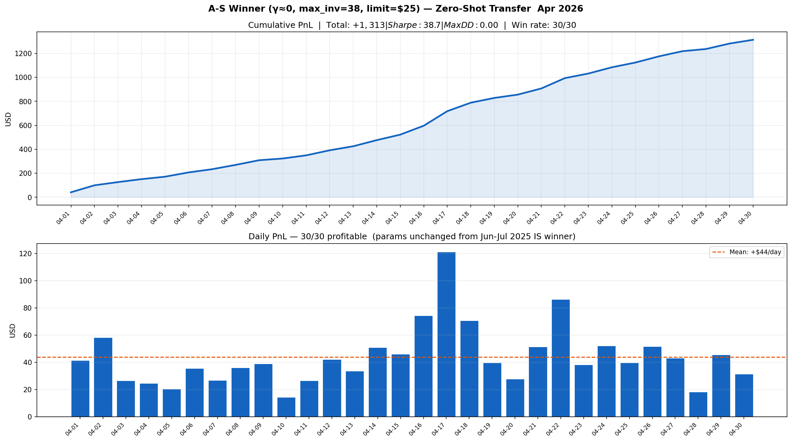
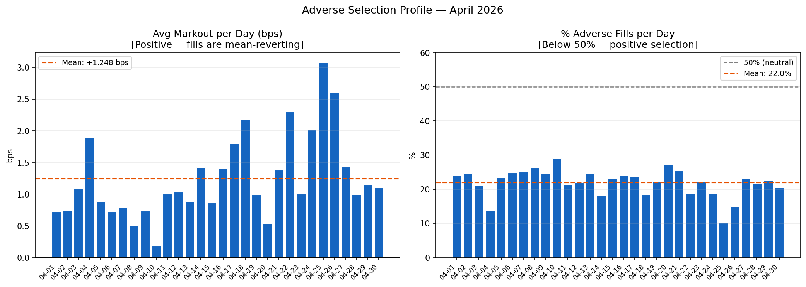
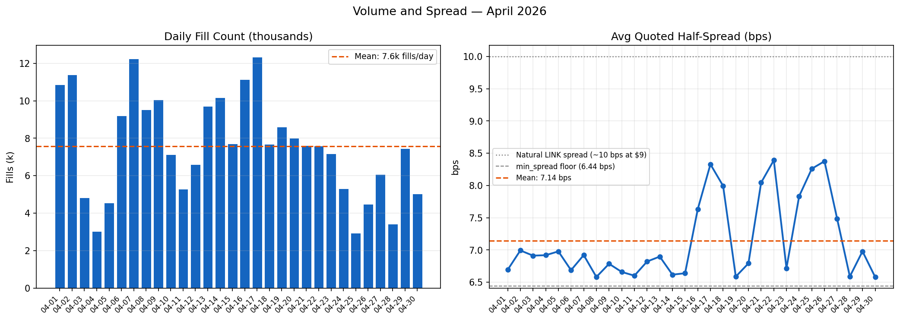
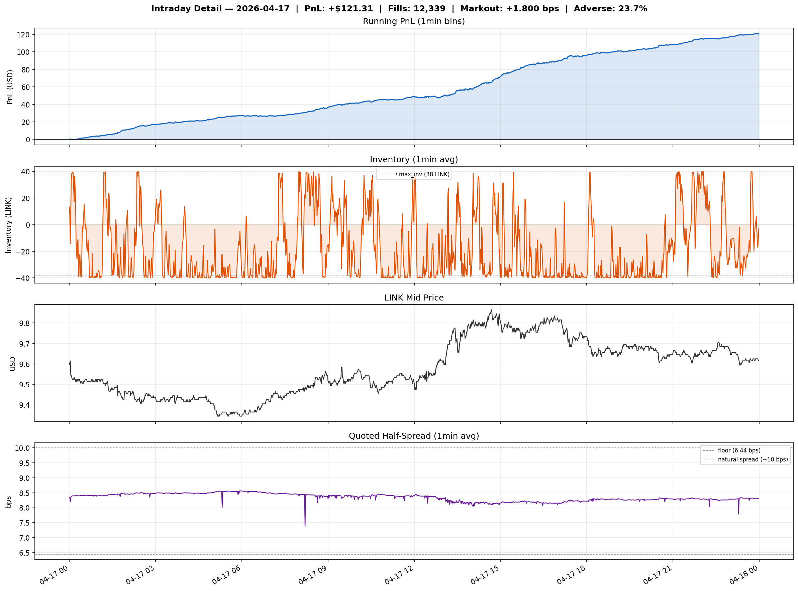
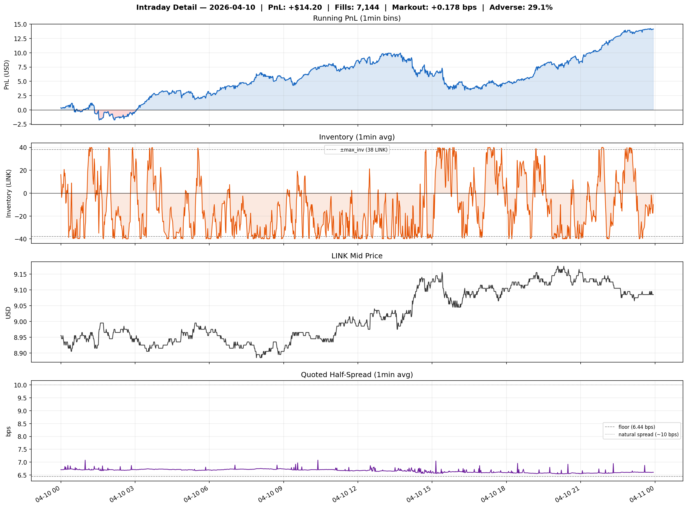

# LINK April 2026 — Zero-Shot Transfer Baseline

**Period**: April 1–30 2026 (30 days)
**Asset**: LINK/USDT, CoinAPI tick data (Binance Spot)
**Tick size**: $0.001, **Order size**: 5 LINK ≈ $45–50
**Params**: unchanged from Jun–Jul 2025 IS winner (γ≈0, min_spread=6.44 bps, max_inv=38, limit=$25)

---

## Summary

| Metric | Value |
|---|---|
| Days run | 30 |
| Win rate | 30/30 (100%) |
| Mean PnL/day | +$43.78 |
| Total PnL | +$1,313.50 |
| Sharpe (daily, √365) | 38.7 |
| Max drawdown | $0.00 |
| Avg markout | +1.248 bps |
| Avg adverse fills | 22.0% |
| Avg fills/day | 7,577 |
| Avg quoted spread | 7.14 bps |

Mean PnL is lower than the Jun–Jul 2025 period (+$149/day) consistent with LINK trading
at ~$9 in April 2026 vs ~$13 in mid-2025 — same tick-count spread, lower notional per fill.
The mean-reversion edge persists 9+ months out of sample with zero recalibration.

---

## Figures

*fig1 — 30-day cumulative PnL and daily bars*

*fig2 — Avg markout (bps) and % adverse fills per day*

*fig3 — Daily fill count and avg quoted half-spread*

*fig4 — Apr 17 intraday at 1-min resolution: PnL, inventory saw-tooth, mid price, spread*

*fig5 — Apr 10 intraday at 1-min resolution: same panels on a lower-volume day*
